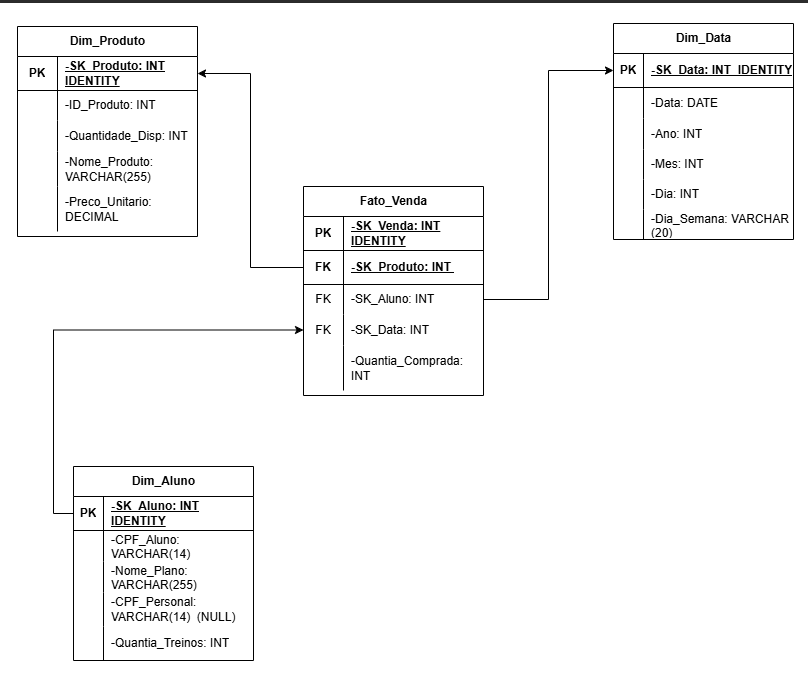
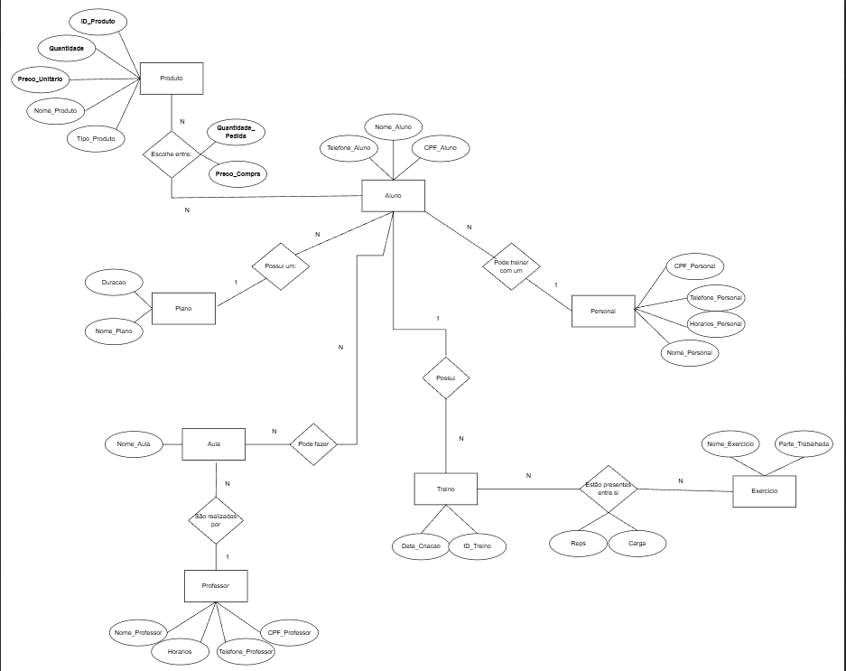
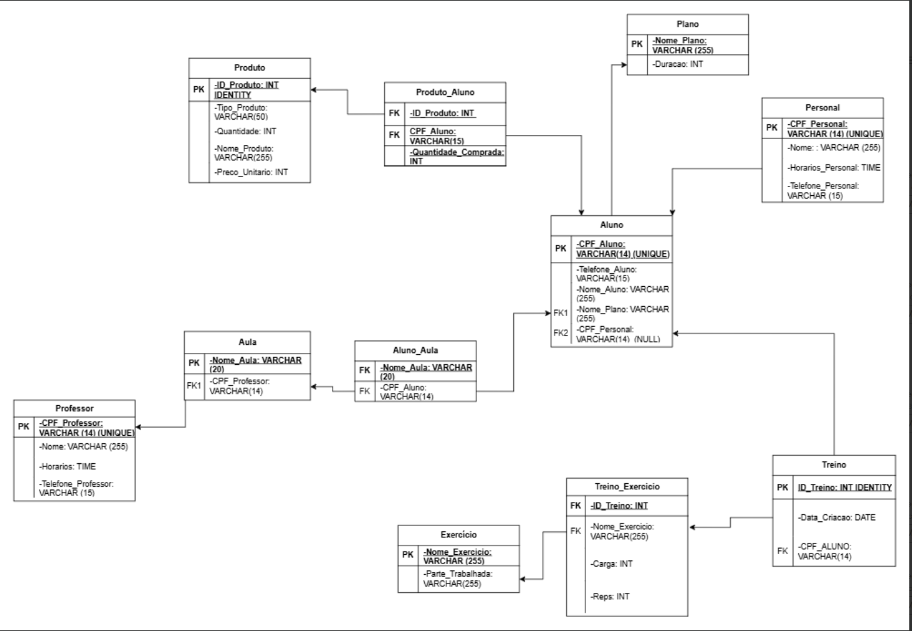
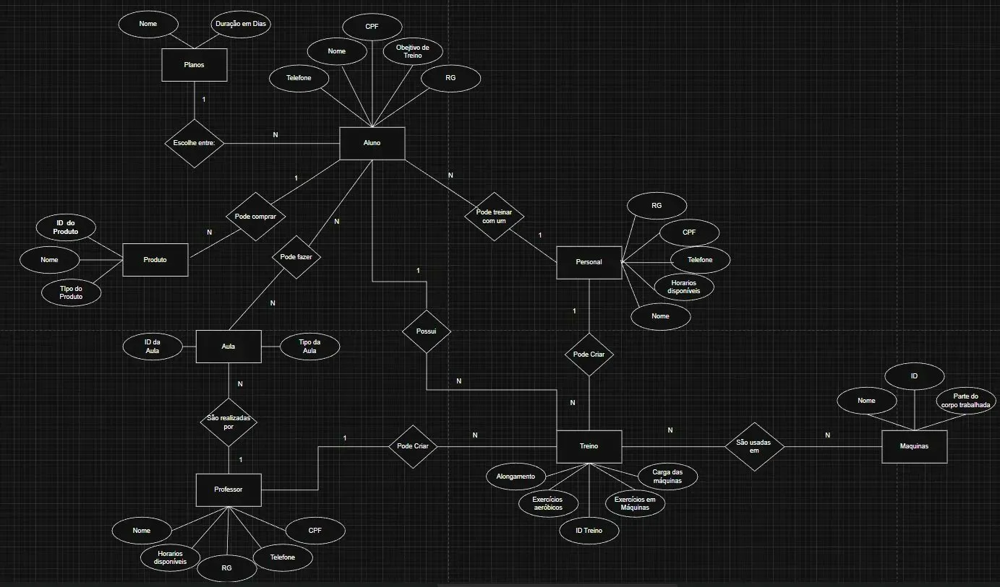
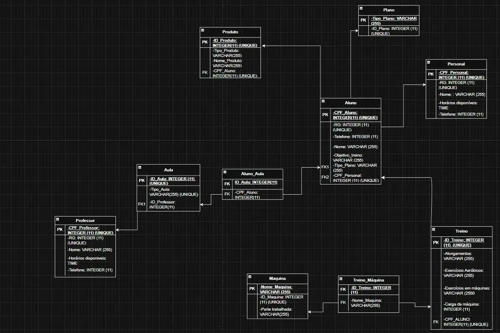

<h1 align="center">🏋️ Gym Data Modeling</h1>

<p align="center">
  
  
  
  
</p>

<p align="center">
  Projeto de engenharia de dados focado em modelagem relacional, containerização e pipeline ETL.<br/>
  Do modelo conceitual (MER) à implementação física em SQL Server via Docker, com Data Warehouse dimensional.
</p>

---

## 📌 Sobre o Projeto

Projeto de engenharia de dados construído do zero — desde o modelo conceitual (MER) até a implementação física em SQL Server rodando via Docker. Inclui geração de dados sintéticos com Faker, pipeline ETL completo e um Data Warehouse dimensional (Star Schema) focado na análise de vendas da academia.

---

## 🗂️ Estrutura do Projeto

```
gym-data-modeling/
├── docker/
│   ├── docker-compose.yml              # Imagem SQL Server 2022
│   └── .env                            # Variáveis de ambiente (senha do banco)
├── docs/
│   ├── Data_Warehouse/
│   │   └── Star_Schema_DER.png         # Diagrama do Star Schema
│   ├── New_Structure/
│   │   ├── New_DER.png
│   │   └── New_MER.png
│   └── Old_Structure/
│       ├── Old_DER.png
│       └── Old_MER.png
├── faker/
│   ├── .env                            # Variáveis de ambiente (senha do banco)
│   └── generate_data.py               # Geração de dados sintéticos com Faker
├── outputs/                            # Evidências de execução real de cada etapa
│   ├── create_data_warehouse/
│   │   ├── dw_creation.png
│   │   └── post_create_dw.png
│   ├── create_database/
│   │   ├── creation.png
│   │   └── post_create.png
│   ├── create_tables/
│   │   ├── creation.png
│   │   ├── no_tables.png
│   │   └── post_creation.png
│   ├── drop_table/
│   │   ├── execution.png
│   │   ├── post_drop1.png
│   │   └── post_drop2.png
│   ├── faker_outputs/
│   │   ├── faker_success.png
│   │   └── select_overall_data/
│   │       ├── faker_aluno.png
│   │       ├── faker_aula.png
│   │       └── faker_produtoAluno.png
│   ├── indexes/
│   │   ├── clust_ix_created_dw.png
│   │   ├── clustered_ix_created.png
│   │   └── index_creation.png
│   ├── views_test/
│   │   ├── select_sys_databases.png
│   │   ├── select_sys_tables1.png
│   │   └── select_sys_tables2.png
│   └── criacao_container.png
├── pipeline/
│   ├── ETL_gym.py                      # Pipeline ETL: Extract, Load e Transform
│   └── extractions/                    # CSVs por execução + staging de vendas
├── sql/
│   ├── queries/
│   │   └── select_overall_test.sql     # Query de validação geral dos dados gerados
│   ├── script_dw/
│   │   ├── create_dw.sql               # DDL do gym_dw — Star Schema (Dim + Fato)
│   │   └── create_index_dw.sql         # Índices do gym_dw
│   └── scripts/
│       ├── create_database.sql         # Criação do banco gym_db
│       ├── create_index.sql            # Índices estratégicos nas FKs
│       ├── create_tables.sql           # DDL com constraints e CHECK
│       ├── drop_table.sql              # Drop das tabelas para reset
│       └── views_test.sql              # Views para testes do dataset
├── .gitignore
└── README.md
```

---

## 🖼️ Evidências de Execução

A pasta `outputs/` documenta cada etapa com screenshots reais, provando que o ambiente funciona de ponta a ponta.

| Pasta | O que documenta |
|---|---|
| `create_data_warehouse/` | Criação do banco `gym_dw` e tabelas do Star Schema |
| `create_database/` | Criação do banco `gym_db` e confirmação via `sys.databases` |
| `create_tables/` | Estado antes e depois da criação das tabelas |
| `drop_table/` | Execução do drop e reset do banco |
| `faker_outputs/` | Execução bem-sucedida do script Faker |
| `faker_outputs/select_overall_data/` | Queries rodando contra dados reais: Aluno, Aula e Produto_Aluno |
| `indexes/` | Criação dos índices nas FKs do gym_db e do gym_dw |
| `views_test/` | Queries de validação rodando contra o banco real |
| `criacao_container.png` | Container `gym_sqlserver` ativo via Docker |

---

## 🔁 Pipeline ETL

O arquivo `pipeline/ETL_gym.py` implementa as três etapas do pipeline conectando `gym_db` (banco transacional) ao `gym_dw` (banco analítico).

### Fluxo geral

```
gym_db (SQL Server)
       │
       ▼ EXTRACT
  CSVs locais (pipeline/extractions/<snapshot>/)
  staging_vendas.csv (datas sintéticas geradas aqui)
       │
       ▼ LOAD
  gym_dw — Star Schema
  ├── Dim_Data      (gerada na ETL com datas sintéticas)
  ├── Dim_Aluno     (snapshot com total de treinos)
  ├── Dim_Produto
  └── Fato_Venda    (inserção em lote via fast_executemany)
       │
       ▼ TRANSFORM
  Validação do resultado — TOP 20 da Fato_Venda
  com SKs e com JOIN nas dimensões
```

### Etapas

**Extract** — lê todas as tabelas do `gym_db` e salva em CSV com timestamp em `pipeline/extractions/<snapshot>/`. Cria uma pasta por execução, garantindo histórico de snapshots.

**Load** — cria o banco `gym_dw` e as tabelas do Star Schema se não existirem, depois carrega as dimensões e a fato na ordem correta. Inclui geração do staging de vendas com datas sintéticas (ver [Decisões do DW](#decisões-do-dw)). A `Fato_Venda` é inserida em lote via `fast_executemany`.

**Transform** — valida o resultado do Load exibindo os primeiros 20 registros da `Fato_Venda` em dois formatos: com os SKs brutos e com JOIN nas dimensões para leitura humana.

### Executar

```bash
pip install pyodbc pandas python-dotenv
python pipeline/ETL_gym.py
```

---

## 🌟 Data Warehouse — gym_dw

O `gym_dw` é o banco analítico do projeto, modelado como **Star Schema** focado na análise de vendas da academia.

### Por que Star Schema

O banco transacional (`gym_db`) é normalizado — ideal para operações de escrita e integridade dos dados. O Star Schema desnormaliza esses dados para facilitar consultas analíticas, eliminando JOINs desnecessários e permitindo agregar métricas por múltiplas dimensões.

### Diagrama



### Tabelas

#### Fato_Venda

Registra cada evento de compra. Cada linha representa uma compra de um produto por um aluno em uma data.

| Coluna | Tipo | Descrição |
|---|---|---|
| `SK_Fato` | `INT IDENTITY` | PK surrogate |
| `SK_Produto` | `INT` | FK → Dim_Produto |
| `SK_Aluno` | `INT` | FK → Dim_Aluno |
| `SK_Data` | `INT` | FK → Dim_Data |
| `Quantia_Comprada` | `INT` | Métrica: unidades compradas |

#### Dim_Aluno

Contexto descritivo do aluno no momento da carga.

| Coluna | Tipo | Descrição |
|---|---|---|
| `SK_Aluno` | `INT IDENTITY` | PK surrogate |
| `CPF_Aluno` | `VARCHAR(14)` | Chave natural |
| `Nome_Plano` | `VARCHAR(255)` | Plano do aluno (desnormalizado) |
| `CPF_Personal` | `VARCHAR(14)` | Personal vinculado (pode ser NULL) |
| `Quantia_Treinos` | `INT` | Snapshot: total de treinos até a carga |

#### Dim_Produto

Contexto descritivo do produto.

| Coluna | Tipo | Descrição |
|---|---|---|
| `SK_Produto` | `INT IDENTITY` | PK surrogate |
| `ID_Produto` | `INT` | Chave natural do gym_db |
| `Nome_Produto` | `VARCHAR(255)` | Nome do produto |
| `Preco_Unitario` | `DECIMAL(10,2)` | Preço unitário |

#### Dim_Data

Gerada inteiramente na ETL a partir das datas sintéticas de compra. Permite análises temporais por dia, mês, ano e dia da semana.

| Coluna | Tipo | Descrição |
|---|---|---|
| `SK_Data` | `INT IDENTITY` | PK surrogate |
| `Data` | `DATE` | Data completa |
| `Ano` | `INT` | Ano extraído |
| `Mes` | `INT` | Mês extraído |
| `Dia` | `INT` | Dia extraído |
| `Dia_Semana` | `VARCHAR(20)` | Nome do dia em português |

### Insights disponíveis

Com o Star Schema carregado, é possível responder perguntas como:

```sql
-- Alunos que mais treinam compram mais?
SELECT
    da.Quantia_Treinos,
    AVG(fv.Quantia_Comprada) AS Media_Comprada
FROM Fato_Venda fv
JOIN Dim_Aluno da ON fv.SK_Aluno = da.SK_Aluno
GROUP BY da.Quantia_Treinos
ORDER BY da.Quantia_Treinos;

-- Quais meses concentram mais vendas?
SELECT
    dd.Ano, dd.Mes,
    SUM(fv.Quantia_Comprada) AS Total_Vendido
FROM Fato_Venda fv
JOIN Dim_Data dd ON fv.SK_Data = dd.SK_Data
GROUP BY dd.Ano, dd.Mes
ORDER BY dd.Ano, dd.Mes;

-- Produtos mais vendidos por plano
SELECT
    da.Nome_Plano,
    dp.Nome_Produto,
    SUM(fv.Quantia_Comprada) AS Total_Vendido
FROM Fato_Venda fv
JOIN Dim_Aluno   da ON fv.SK_Aluno   = da.SK_Aluno
JOIN Dim_Produto dp ON fv.SK_Produto = dp.SK_Produto
GROUP BY da.Nome_Plano, dp.Nome_Produto
ORDER BY da.Nome_Plano, Total_Vendido DESC;

-- Ticket médio por dia da semana
SELECT
    dd.Dia_Semana,
    AVG(fv.Quantia_Comprada * dp.Preco_Unitario) AS Ticket_Medio
FROM Fato_Venda fv
JOIN Dim_Data    dd ON fv.SK_Data    = dd.SK_Data
JOIN Dim_Produto dp ON fv.SK_Produto = dp.SK_Produto
GROUP BY dd.Dia_Semana;
```

### Decisões do DW

**Surrogate Keys em vez de chaves naturais** — cada dimensão tem um `INT IDENTITY` gerado pelo próprio DW como PK. A chave natural (CPF, ID_Produto) é mantida como campo auxiliar para rastreabilidade, mas não é usada como chave de relacionamento. Isso isola o DW de mudanças no banco transacional.

**`SK_Fato` na Fato_Venda** — a fato usa uma surrogate key própria como PK em vez de PK composta pelas FKs. Isso evita colisões quando o mesmo aluno compra o mesmo produto em datas próximas que podem coincidir nas datas sintéticas geradas.

**`Quantia_Treinos` como snapshot** — o total de treinos do aluno é calculado e congelado no momento da carga do ETL. Representa o estado do aluno quando a análise foi executada. Em produção, `Data_Compra` existiria na tabela `Produto_Aluno` e permitiria calcular o valor exato no momento de cada compra.

**Datas sintéticas na `Dim_Data`** — a tabela `Produto_Aluno` do `gym_db` não possui `Data_Compra`. O ETL gera datas aleatórias entre 01/01/2024 e hoje para cada compra e salva o staging em `pipeline/extractions/<snapshot>/staging_vendas.csv`. Em produção, `Data_Compra` existiria na fonte.

**`Preco_Total` não é armazenado** — calculado via SELECT (`Quantia_Comprada * Preco_Unitario`). Armazená-lo criaria redundância e risco de inconsistência.

**Dimensões não se relacionam entre si** — toda ligação passa pela `Fato_Venda`. Esse é o princípio central do Star Schema.

### Criando o gym_dw

Execute o arquivo `sql/script_dw/create_dw.sql` após o `gym_db` estar criado e populado. O ETL também cria as tabelas automaticamente na primeira execução se o banco já existir.

---

## 📐 Modelagem — gym_db

### Entidades

| Entidade | Descrição |
|---|---|
| `Aluno` | Cadastro de alunos com plano e personal vinculados |
| `Plano` | Tipos de plano disponíveis na academia |
| `Personal` | Profissionais de personal trainer |
| `Professor` | Professores responsáveis pelas aulas |
| `Aula` | Aulas oferecidas pela academia |
| `Produto` | Produtos disponíveis para compra |
| `Treino` | Treinos criados |
| `Exercicio` | Exercícios disponíveis com parte do corpo trabalhada |

### Tabelas Intermediárias (N:N)

| Tabela | Relacionamento |
|---|---|
| `Aluno_Aula` | Aluno participa de muitas aulas |
| `Produto_Aluno` | Aluno pode comprar muitos produtos |
| `Treino_Exercicio` | Treino contém muitos exercícios, com Carga e Reps |

### Diagramas

#### Estrutura atual (aprovada)




#### Estrutura anterior




---

## 💡 Decisões de Modelagem

### `Produto_Aluno` — FKs com `Quantidade_Comprada`

A tabela `Produto_Aluno` registra a relação N:N entre alunos e produtos. O campo `Quantidade_Comprada` é um atributo do próprio relacionamento — não pertence ao Produto nem ao Aluno isoladamente, mas à combinação dos dois.

> 💡 Valores derivados como total gasto e ticket médio são calculados via SELECT — não estão armazenados.

### `Treino_Exercicio` — `Carga` e `Reps` além das FKs

`Carga` e `Reps` são atributos do relacionamento entre Treino e Exercício. Não existe forma de derivar via SELECT que um aluno fez supino com 80kg e 10 repetições em determinado treino — esse dado precisa ser registrado. Removê-los seria perda irreversível de informação.

### `Preco_Unitario` — tipo `DECIMAL(10,2)`

Valores monetários usam `DECIMAL(10,2)` em vez de `INT` para preservar as casas decimais dos preços em reais.

---

## 🔒 Integridade e Performance

### CHECK Constraints

| Constraint | Tabela | Regra |
|---|---|---|
| `CK_Plano_Duracao_Positiva` | `Plano` | `Duracao > 0` |
| `CK_Produto_Preco_Positivo` | `Produto` | `Preco_Unitario > 0` |
| `CK_Produto_Quantidade_Valida` | `Produto` | `Quantidade >= 0` |
| `CK_Produto_Aluno_Quantidade_Positiva` | `Produto_Aluno` | `Quantidade_Comprada > 0` |
| `CK_Treino_Exercicio_Carga_Nao_Negativa` | `Treino_Exercicio` | `Carga >= 0` |
| `CK_Treino_Exercicio_Reps_Validas` | `Treino_Exercicio` | `Reps BETWEEN 1 AND 100` |

### Índices estratégicos

| Índice | Tabela | Coluna(s) | Objetivo |
|---|---|---|---|
| `IX_Aluno_Nome_Plano` | `Aluno` | `Nome_Plano` | FK → Plano |
| `IX_Aluno_CPF_Personal` | `Aluno` | `CPF_Personal` | FK → Personal |
| `IX_Aula_CPF_Professor` | `Aula` | `CPF_Professor` | FK → Professor |
| `IX_Aluno_Aula_Nome_Aula` | `Aluno_Aula` | `Nome_Aula` | FK → Aula |
| `IX_Aluno_Aula_CPF_Aluno` | `Aluno_Aula` | `CPF_Aluno` | FK → Aluno |
| `IX_Produto_Aluno_ID_Produto` | `Produto_Aluno` | `ID_Produto` | FK → Produto |
| `IX_Produto_Aluno_CPF_Aluno` | `Produto_Aluno` | `CPF_Aluno` | FK → Aluno |
| `IX_Treino_CPF_Aluno` | `Treino` | `CPF_Aluno` | FK → Aluno |
| `IX_Treino_Data_Criacao` | `Treino` | `Data_Criacao` | Acelerar consultas por período |
| `IX_Treino_Exercicio_ID_Treino` | `Treino_Exercicio` | `ID_Treino` | FK → Treino |
| `IX_Treino_Exercicio_Nome_Exercicio` | `Treino_Exercicio` | `Nome_Exercicio` | FK → Exercicio |
| `IX_Treino_Exercicio_ID_Carga` | `Treino_Exercicio` | `ID_Treino, Carga` | Acelerar JOIN com filtro de carga |

---

## 📋 Modelo atual — estrutura das tabelas

### Plano

| Coluna | Tipo | Constraint |
|---|---|---|
| `Nome_Plano` | `VARCHAR(255)` | PK |
| `Duracao` | `INT` | CHECK > 0 |

### Aluno

| Coluna | Tipo | Constraint |
|---|---|---|
| `CPF_Aluno` | `VARCHAR(14)` | PK |
| `Telefone_Aluno` | `VARCHAR(15)` | |
| `Nome_Aluno` | `VARCHAR(255)` | |
| `Nome_Plano` | `VARCHAR(255)` | FK → Plano |
| `CPF_Personal` | `VARCHAR(14)` | FK → Personal |

### Personal

| Coluna | Tipo | Constraint |
|---|---|---|
| `CPF_Personal` | `VARCHAR(14)` | PK |
| `Nome` | `VARCHAR(255)` | |
| `Horarios_Personal` | `TIME` | |
| `Telefone_Personal` | `VARCHAR(15)` | |

### Professor

| Coluna | Tipo | Constraint |
|---|---|---|
| `CPF_Professor` | `VARCHAR(14)` | PK |
| `Nome` | `VARCHAR(255)` | |
| `Horarios_Professor` | `TIME` | |
| `Telefone_Professor` | `VARCHAR(15)` | |

### Aula

| Coluna | Tipo | Constraint |
|---|---|---|
| `Nome_Aula` | `VARCHAR(20)` | PK |
| `CPF_Professor` | `VARCHAR(14)` | FK → Professor |

### Aluno_Aula

| Coluna | Tipo | Constraint |
|---|---|---|
| `Nome_Aula` | `VARCHAR(20)` | FK → Aula |
| `CPF_Aluno` | `VARCHAR(14)` | FK → Aluno |

### Produto

| Coluna | Tipo | Constraint |
|---|---|---|
| `ID_Produto` | `INT IDENTITY` | PK |
| `Tipo_Produto` | `VARCHAR(50)` | |
| `Quantidade` | `INT` | CHECK >= 0 |
| `Nome_Produto` | `VARCHAR(255)` | |
| `Preco_Unitario` | `DECIMAL(10,2)` | CHECK > 0 |

### Produto_Aluno

| Coluna | Tipo | Constraint |
|---|---|---|
| `ID_Produto` | `INT` | FK → Produto |
| `CPF_Aluno` | `VARCHAR(14)` | FK → Aluno |
| `Quantidade_Comprada` | `INT` | CHECK > 0 |

### Treino

| Coluna | Tipo | Constraint |
|---|---|---|
| `ID_Treino` | `INT IDENTITY` | PK |
| `Data_Criacao` | `DATE` | |
| `CPF_Aluno` | `VARCHAR(14)` | FK → Aluno |

### Exercicio

| Coluna | Tipo | Constraint |
|---|---|---|
| `Nome_Exercicio` | `VARCHAR(255)` | PK |
| `Parte_Trabalhada` | `VARCHAR(255)` | |

### Treino_Exercicio

| Coluna | Tipo | Constraint |
|---|---|---|
| `ID_Treino` | `INT` | FK → Treino |
| `Nome_Exercicio` | `VARCHAR(255)` | FK → Exercicio |
| `Carga` | `INT` | CHECK >= 0 |
| `Reps` | `INT` | CHECK 1–100 |

---

## 🐳 Como Rodar

**1. Clone o repositório:**

```bash
git clone https://github.com/seu-usuario/gym-data-modeling.git
cd gym-data-modeling
```

**2. Crie o arquivo `.env` na pasta `docker/`:**

```env
DB_PASSWORD=SuaSenhaForte123!
```

> ⚠️ A senha precisa conter maiúscula, número e caractere especial — requisito do SQL Server.

**3. Suba o container:**

```bash
cd docker
docker compose up -d
```

**4. Verifique se está rodando:**

```bash
docker ps
```

O container `gym_sqlserver` deve aparecer com status `Up`.

---

## 🔌 Conectando ao Banco via VS Code

**1. Instale a extensão `mssql`** da Microsoft no marketplace do VS Code.

**2. Crie a conexão** via `Ctrl + Shift + P` → `MS SQL: Connect`:

| Campo | Valor |
|---|---|
| Server name | `localhost,1433` |
| Authentication type | SQL Login |
| User name | `sa` |
| Password | a definida no `.env` |
| Trust server certificate | ✅ marcado |
| Encrypt | Optional |

**3. Execute os scripts na ordem:**

```
sql/scripts/create_database.sql
sql/scripts/create_tables.sql
sql/scripts/create_index.sql
sql/script_dw/create_dw.sql
sql/script_dw/create_index_dw.sql
```

---

## 🐍 Gerando Dados com Faker

### Pré-requisitos

**1. Instale o ODBC Driver para SQL Server:**

- **Windows:** [Download Microsoft ODBC Driver](https://learn.microsoft.com/pt-br/sql/connect/odbc/download-odbc-driver-for-sql-server)
- **Linux (Ubuntu/Debian):**

```bash
curl https://packages.microsoft.com/keys/microsoft.asc | sudo apt-key add -
curl https://packages.microsoft.com/config/ubuntu/$(lsb_release -rs)/prod.list \
  | sudo tee /etc/apt/sources.list.d/mssql-release.list
sudo apt-get update
sudo ACCEPT_EULA=Y apt-get install -y msodbcsql18
```

- **macOS:**

```bash
brew tap microsoft/mssql-release https://github.com/Microsoft/homebrew-mssql-release
brew install msodbcsql18
```

**2. Instale as dependências Python:**

```bash
pip install pyodbc faker faker-br python-dotenv
```

**3. Configure o `.env` na pasta `faker/`:**

```env
DB_PASSWORD=SuaSenhaForte123!
```

**4. Execute:**

```bash
python faker/generate_data.py
```

### Volumes gerados

| Tabela | Registros |
|---|---|
| `Plano` | 4 |
| `Personal` | 10 |
| `Professor` | 5 |
| `Aluno` | 50 |
| `Aula` | 5 |
| `Aluno_Aula` | ~100 |
| `Produto` | 10 |
| `Produto_Aluno` | ~60 |
| `Exercicio` | 12 |
| `Treino` | ~150 |
| `Treino_Exercicio` | ~600 |

---

## 🔍 Validando os Dados Gerados

```sql
USE gym_db

SELECT * FROM Aula;
GO

SELECT * FROM Professor
WHERE CPF_Professor = '416.972.853-09'
OR CPF_Professor = '968.054.713-20';
GO

SELECT * FROM Produto_Aluno;
GO

SELECT * FROM Aluno
WHERE CPF_Aluno IN (SELECT CPF_Aluno FROM Produto_Aluno);
GO
```

Os resultados estão documentados em `outputs/faker_outputs/select_overall_data/`.

---

## 🛠️ Tecnologias

| Tecnologia | Uso |
|---|---|
| **SQL Server 2022** | Banco transacional (gym_db) e dimensional (gym_dw) |
| **Docker** | Containerização do ambiente |
| **Python** | Geração de dados com Faker e pipeline ETL |
| **ODBC Driver 17/18** | Conexão Python → SQL Server via pyodbc |
| **draw.io** | Modelagem do MER, DER e Star Schema |
| **VS Code** | Ambiente de desenvolvimento |

---

## 🚧 Status do Projeto

- [x] Modelagem conceitual (MER)
- [x] Modelagem lógica (DER)
- [x] Revisão e aprovação do MER e DER
- [x] Container Docker configurado
- [x] DDL — `create_tables.sql`
- [x] CHECK constraints e índices
- [x] Geração de dados com Faker
- [x] `.env` isolado na pasta `faker/`
- [x] Evidências de execução — `outputs/`
- [x] Queries de validação — `select_overall_test.sql`
- [x] Pipeline ETL — Extract e Load
- [x] Star Schema — `gym_dw`
- [x] Load dimensional completo — `Dim_Data`, `Dim_Aluno`, `Dim_Produto`, `Fato_Venda`
- [x] Transform — validação do resultado via JOIN nas dimensões
- [ ] Upload para AWS S3